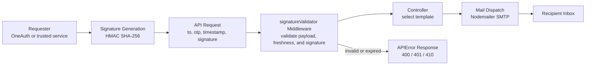
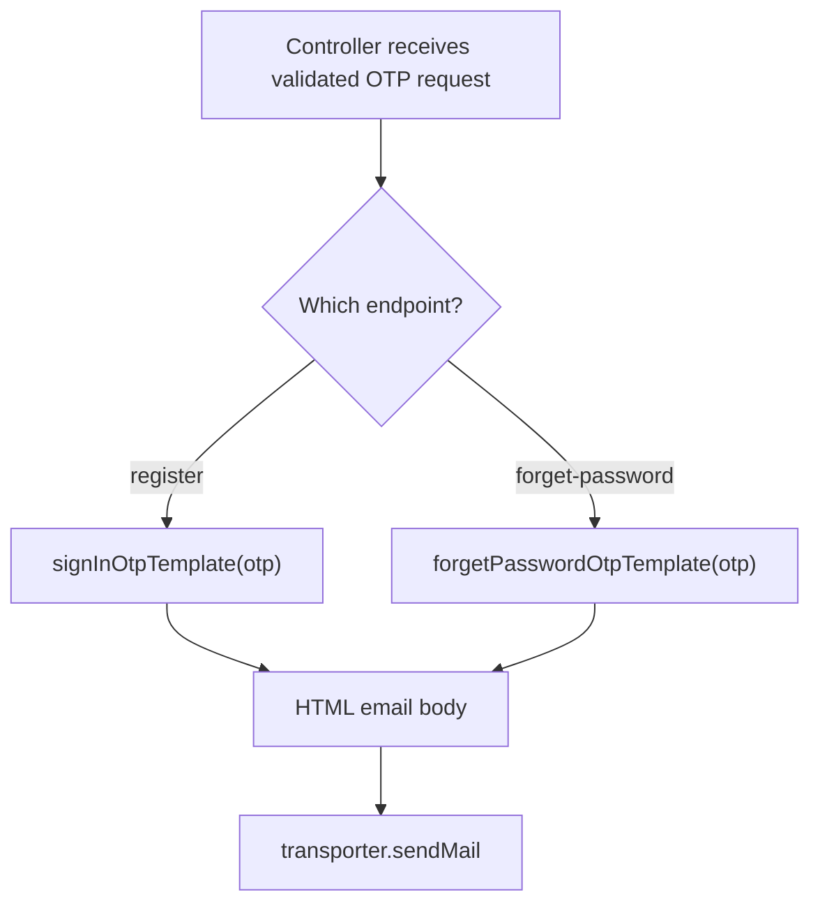
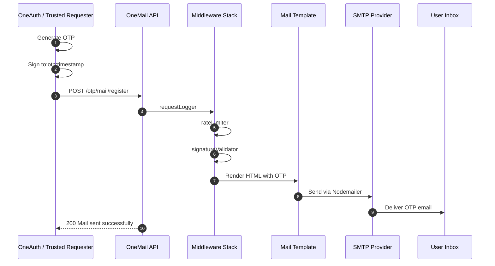

# OneMail API

<div align="center">


**Secure OTP delivery and mail templating microservice for the OneAuth ecosystem**


</div>

## Brand System

| Token | Value |
| --- | --- |
| Header font | Poppins |
| Body font | Nunito Sans |
| Background | White |
| Primary text | Black |
| Secondary text | Dark Gray |
| Accent | Sky Blue, `bg-sky-500`, `#0ea5e9` |

> GitHub README rendering does not reliably load custom web fonts, so this documentation uses a GitHub-safe Markdown structure while preserving the requested visual language through spacing, badges, Mermaid diagrams, and sky-blue accent references.

## Overview

OneMail API is a dedicated mail microservice for secure One-Time Password delivery. It is intentionally small, stateless, and focused: upstream services such as OneAuth generate OTPs, sign the request, and ask OneMail to deliver the message through an SMTP provider.

The service exists to keep email delivery out of the authentication core. OneAuth owns identity, OTP generation, and OTP verification. OneMail owns request authenticity checks, mail template rendering, SMTP delivery, request logging, rate limiting, and consistent API error responses.

## Secure Mail Request Flow



## Why OneMail Works

| Capability | What it provides |
| --- | --- |
| Signature security | Prevents arbitrary clients from triggering OTP emails and reduces email-spam abuse risk. |
| Template separation | Keeps HTML email content in `templates/`, away from route and controller logic. |
| Microservice boundary | Lets OneAuth call a focused `ONE_MAIL_SERVER_URL` or mail service URL without coupling authentication logic to SMTP details. |
| Stateless operation | No database is required; the service does not store OTPs or user accounts. |
| SMTP abstraction | Nodemailer allows the service to work with Gmail SMTP, SES, SendGrid SMTP, or a private SMTP relay. |

## Core Responsibilities

OneMail handles:

| Responsibility | Description |
| --- | --- |
| Signed request intake | Receives OTP delivery requests from trusted internal services. |
| Signature validation | Verifies the HMAC SHA-256 signature generated with a shared secret. |
| Timestamp freshness | Rejects stale or future-dated signed payloads to reduce replay attacks. |
| Rate limiting | Applies endpoint-level abuse protection with `express-rate-limit`. |
| Template rendering | Injects dynamic OTP data into HTML templates. |
| SMTP dispatch | Sends transactional emails through the configured SMTP account. |
| Observability | Logs requests and errors through custom Winston logging. |

OneMail does not handle:

| Out of scope | Owner |
| --- | --- |
| OTP generation | OneAuth or the upstream requester |
| OTP persistence | OneAuth or the upstream requester |
| OTP verification | OneAuth or the upstream requester |
| User account storage | OneAuth |
| Marketing campaigns | A separate email or campaign service |

## Architecture

```text
.
|-- app.ts
|-- server.ts
|-- config/
|   |-- env.ts
|   `-- mailer.ts
|-- controllers/
|   `-- otp.controller.ts
|-- middlewares/
|   |-- errorHandler.ts
|   |-- rateLimiter.ts
|   |-- requestLogger.ts
|   `-- signatureValidator.ts
|-- routes/
|   `-- otp.routes.ts
|-- templates/
|   |-- forgetPwd-otp.template.ts
|   `-- signin-otp.template.ts
`-- utils/
    |-- APIError.ts
    |-- logger.ts
    `-- signatureGenerator.ts
```

### Application Entry

| File | Role |
| --- | --- |
| `server.ts` | Starts the HTTP server on `config.port`. |
| `app.ts` | Creates the Express app, configures JSON parsing, request logging, health route, OTP route mounting, 404 handling, and global error handling. |

### Config Layer

| File | Role |
| --- | --- |
| `config/env.ts` | Loads environment variables through `dotenv` and exposes typed runtime configuration. |
| `config/mailer.ts` | Creates the Nodemailer transporter from SMTP host, port, user, and password. Production mode enables stricter TLS behavior. |

### Controller Layer

| File | Role |
| --- | --- |
| `controllers/otp.controller.ts` | Contains OTP mail use cases: registration OTP and password-reset OTP. Each controller selects the correct template and calls `transporter.sendMail`. |

### Route Layer

| File | Role |
| --- | --- |
| `routes/otp.routes.ts` | Defines OTP mail endpoints under the `/otp` prefix. |

Current protected endpoints:

| Method | Endpoint | Controller | Purpose |
| --- | --- | --- | --- |
| `POST` | `/otp/mail/register` | `sendRegisterOtp` | Sends registration verification OTP. |
| `POST` | `/otp/mail/forget-password` | `sendForgetPasswordOtp` | Sends password reset OTP. |

### Middleware Layer

| Middleware | Role |
| --- | --- |
| `requestLogger.ts` | Measures request duration and logs request metadata. |
| `rateLimiter.ts` | Limits excessive requests by IP and reports `429` through `APIError`. |
| `signatureValidator.ts` | Validates signed OTP delivery requests. |
| `errorHandler.ts` | Converts thrown errors and `APIError` instances into JSON responses. |

Recommended protected pipeline:

```ts
app.use(express.json({ limit: isProduction ? "10kb" : "1mb" }));
app.use(requestLogger);
app.use("/otp", rateLimiter, OTPRouter);
app.use(errorHandler);
```

The mail routes mount `signatureValidator` before each controller:

```ts
OTPRouter.post("/mail/register", signatureValidator, sendRegisterOtp);
OTPRouter.post("/mail/forget-password", signatureValidator, sendForgetPasswordOtp);
```

## Security Mechanism

OneMail's primary security control is HMAC-based request signing. This matters because OTP mail endpoints can otherwise be abused to spam users, drain provider limits, or generate confusing account emails.

### `signatureGenerator.ts`

`utils/signatureGenerator.ts` creates a deterministic HMAC SHA-256 signature from:

```text
to:otp:timestamp
```

The utility:

1. Reads the shared secret from runtime config.
2. Rejects missing secrets.
3. Rejects weak production secrets such as `QWERTY`.
4. Uses Node's `crypto.createHmac("sha256", secret)`.
5. Returns a hex digest.

Example signing logic:

```ts
import crypto from "crypto";

const timestamp = Date.now().toString();
const data = `${to}:${otp}:${timestamp}`;

const signature = crypto
  .createHmac("sha256", process.env.SIGNATURE_SECRET!)
  .update(data)
  .digest("hex");
```

### `signatureValidator.ts`

`middlewares/signatureValidator.ts` protects mail endpoints by validating both the payload and the signature.

Validation steps:

| Step | Check |
| --- | --- |
| Required fields | Ensures `to`, `otp`, `timestamp`, and `signature` exist. |
| Type safety | Ensures all fields are non-empty strings. |
| Normalization | Trims values and lowercases the recipient email. |
| Timestamp format | Ensures timestamp is a positive numeric millisecond string. |
| Future timestamp | Rejects requests whose timestamp is ahead of server time. |
| Replay window | Rejects expired requests. Production allows a shorter window than development. |
| HMAC comparison | Regenerates the expected signature and compares it using `crypto.timingSafeEqual`. |
| Sanitized body | Stores normalized values in `req.body.data` for downstream usage. |

Timestamp window:

| Environment | Max request age |
| --- | --- |
| Development | 10 minutes |
| Production | 2 minutes |

### Signature Payload

```json
{
  "to": "user@example.com",
  "otp": "123456",
  "timestamp": "1777635000000",
  "signature": "generated_hmac_sha256_hex_digest"
}
```

### Security Responses

| Failure | Status | Message |
| --- | ---: | --- |
| Missing payload fields | `400` | `Missing required fields` |
| Invalid field types | `400` | `All payload must be string and non-empty` |
| Invalid timestamp | `400` | `Invalid timestamp format` |
| Future timestamp | `400` | `Timestamp from future` |
| Expired request | `410` | `Request Expired` |
| Invalid signature | `401` | `Invalid signature` |

## Environment Configuration

The active runtime configuration is defined in `config/env.ts`.

### Active Variables

| Variable | Used by | Required | Default | Description |
| --- | --- | --- | --- | --- |
| `PORT` | `config/env.ts`, `server.ts` | No | `5002` in development, `8080` in production | Server port for the OneMail API. |
| `ENVIRONMENT` | `config/env.ts` | No | `development` | Runtime mode. Set to `production` to enforce production behavior. |
| `MAIL_HOST` | `config/env.ts`, `config/mailer.ts` | Yes | None | SMTP host, such as `smtp.gmail.com`. |
| `MAIL_PORT` | `config/env.ts`, `config/mailer.ts` | Yes | None | SMTP port, usually `587` for STARTTLS or `465` for secure SMTP. |
| `MAIL_USER` | `config/env.ts`, `config/mailer.ts` | Yes | None | SMTP username or sender account. |
| `MAIL_PASS` | `config/env.ts`, `config/mailer.ts` | Yes | None | SMTP password or provider app password. |
| `SIGNATURE_SECRET` | `config/env.ts`, `utils/signatureGenerator.ts` | Required in production | `dev_secret_key` outside production | Shared secret used to generate and validate HMAC request signatures. |
| `RATE_LIMIT` | `config/env.ts`, `middlewares/rateLimiter.ts` | No | `10` in development, `100` in production | Maximum requests allowed per rate-limit window. |
| `RATE_LIMIT_WINDOW` | `config/env.ts`, `middlewares/rateLimiter.ts` | No | `60000` | Rate-limit window in milliseconds. |

### Requested Naming Map

If another service, such as OneAuth, refers to this service with `ONE_MAIL_SERVER_URL`, map it to the public base URL where this API is deployed. The current code uses the following internal names:

| Concept | Requested name | Current code name | Notes |
| --- | --- | --- | --- |
| Service base URL | `MAIL_SERVER_URL` or `ONE_MAIL_SERVER_URL` | Not consumed by this service | Used by upstream services to call OneMail, for example `http://localhost:5002`. |
| Signature secret | `MAIL_SERVER_SECRET` | `SIGNATURE_SECRET` | Both services must use the same value for HMAC signing. |
| SMTP host | `SMTP_HOST` | `MAIL_HOST` | Rename in code only if you want SMTP-prefixed env names. |
| SMTP port | `SMTP_PORT` | `MAIL_PORT` | Numeric SMTP port. |
| SMTP user | `SMTP_USER` | `MAIL_USER` | Sender account. |
| SMTP password | `SMTP_PASS` | `MAIL_PASS` | App password or SMTP credential. |

### Example `.env`

```env
PORT=5002
ENVIRONMENT=development

MAIL_HOST=smtp.gmail.com
MAIL_PORT=587
MAIL_USER=your-smtp-user@example.com
MAIL_PASS=your-provider-app-password

SIGNATURE_SECRET=replace-with-a-long-random-secret
RATE_LIMIT=10
RATE_LIMIT_WINDOW=60000
```

Do not commit real SMTP passwords or production signing secrets.

## Mail Templates

Templates live in `templates/` and return complete HTML email documents.

| Template | Function | Use case | Dynamic values |
| --- | --- | --- | --- |
| `templates/signin-otp.template.ts` | `signInOtpTemplate(otp)` | Registration or sign-in verification email. | Injects `otp` into the highlighted OTP block. |
| `templates/forgetPwd-otp.template.ts` | `forgetPasswordOtpTemplate(otp)` | Password reset verification email. | Injects `otp` into the reset OTP block. |

Template rendering flow:



The templates are plain TypeScript functions, which keeps rendering predictable and easy to test. Dynamic data is injected through function parameters rather than through global state or a template engine.

## API Reference

### Health Check

```http
GET /
```

Success response:

```json
{
  "success": true,
  "message": "Auth Mail server is alive",
  "env": "development"
}
```

### Send Registration OTP

```http
POST /otp/mail/register
Content-Type: application/json
```

Request body:

```json
{
  "to": "user@example.com",
  "otp": "123456",
  "timestamp": "1777635000000",
  "signature": "generated_hmac_sha256_hex_digest"
}
```

Success response:

```json
{
  "message": "Mail sent successfully",
  "success": true
}
```

### Send Password Reset OTP

```http
POST /otp/mail/forget-password
Content-Type: application/json
```

Request body:

```json
{
  "to": "user@example.com",
  "otp": "123456",
  "timestamp": "1777635000000",
  "signature": "generated_hmac_sha256_hex_digest"
}
```

Success response:

```json
{
  "message": "Mail sent successfully",
  "success": true
}
```

## Upstream Integration Example

This is how OneAuth or another trusted backend should sign and call OneMail:

```ts
import crypto from "crypto";

async function sendOtpMail(to: string, otp: string) {
  const timestamp = Date.now().toString();
  const normalizedTo = to.trim().toLowerCase();
  const data = `${normalizedTo}:${otp}:${timestamp}`;

  const signature = crypto
    .createHmac("sha256", process.env.SIGNATURE_SECRET!)
    .update(data)
    .digest("hex");

  const response = await fetch(`${process.env.ONE_MAIL_SERVER_URL}/otp/mail/register`, {
    method: "POST",
    headers: {
      "Content-Type": "application/json"
    },
    body: JSON.stringify({
      to: normalizedTo,
      otp,
      timestamp,
      signature
    })
  });

  if (!response.ok) {
    throw new Error("OneMail failed to send OTP");
  }

  return response.json();
}
```

## Installation & Setup

### Prerequisites

| Requirement | Recommended |
| --- | --- |
| Node.js | `18+` |
| npm | `9+` |
| SMTP account | Gmail app password, SendGrid SMTP, SES SMTP, or equivalent |

### Install

```bash
npm install
```

### Configure Environment

Create `.env` in the project root:

```bash
cp .env.example .env
```

If `.env.example` is not present yet, create `.env` manually using the example from the Environment Configuration section.

### Development Server

```bash
npm run dev
```

Default local URL:

```text
http://localhost:5002
```

### Build

```bash
npm run build
```

### Production Start

```bash
npm start
```

## Request Lifecycle



## Logging & Observability

`utils/logger.ts` configures Winston with:

| Transport | Purpose |
| --- | --- |
| Console | Local and runtime visibility. |
| `logs/error-%DATE%.log` | Daily rotating error logs. |
| `logs/combined-%DATE%.log` | Daily rotating combined logs. |

Development logs are human-readable. Production logs use structured JSON formatting, which is better suited for log aggregation tools.

`middlewares/requestLogger.ts` captures:

| Field | Description |
| --- | --- |
| `timestamp` | ISO request completion time. |
| `ip` | Client IP or forwarded IP in production. |
| `method` | HTTP method. |
| `status` | Response status code. |
| `duration` | Request duration in milliseconds. |
| `url` | Requested path. |
| `userAgent` | Caller user agent. |

## Error Handling

`utils/APIError.ts` defines a custom error type with an HTTP status code. `middlewares/errorHandler.ts` centralizes JSON error responses.

| Error source | Behavior |
| --- | --- |
| `APIError` | Uses the provided status code and message. |
| Unknown error | Returns `500`; hides stack traces in production. |
| SMTP failure | Controller returns `Failed to send OTP`. |
| Unknown route | App returns `404 Route not found`. |

Example error response:

```json
{
  "success": false,
  "message": "Invalid signature"
}
```

## Production Checklist

| Item | Status |
| --- | --- |
| Set `ENVIRONMENT=production` | Required |
| Use a strong `SIGNATURE_SECRET` | Required |
| Mount `signatureValidator` on OTP routes | Required |
| Use HTTPS in front of the service | Required |
| Use a production SMTP provider | Recommended |
| Rotate SMTP credentials | Recommended |
| Centralize logs | Recommended |
| Monitor `429`, `401`, and `500` rates | Recommended |

## Recommended Hardening

1. Apply `signatureValidator` directly to both OTP routes.
2. Keep `SIGNATURE_SECRET` at least 32 random bytes.
3. Rotate the shared secret periodically and coordinate rotation with OneAuth.
4. Avoid default or weak values in production.
5. Add request body validation for email format and OTP format if upstream guarantees are not enough.
6. Keep rate limits strict because OTP email endpoints are high-abuse targets.
7. Use provider-specific app passwords or API keys rather than personal mailbox passwords.

## Tech Stack

| Layer | Technology |
| --- | --- |
| Runtime | Node.js |
| Language | TypeScript |
| Framework | Express.js |
| Mail | Nodemailer |
| Security | Node Crypto HMAC SHA-256 |
| Rate limiting | express-rate-limit |
| Logging | Winston and winston-daily-rotate-file |
| Configuration | dotenv |

## License

MIT
